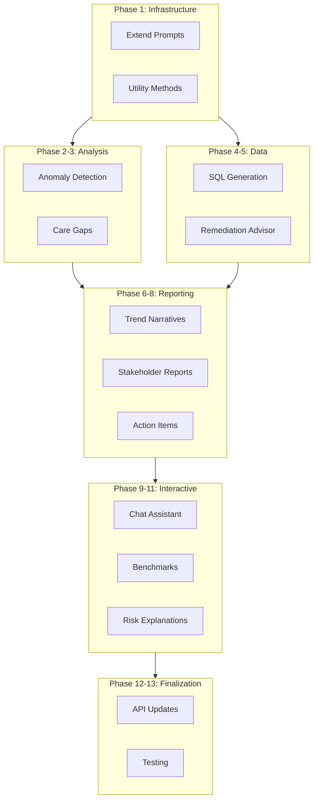

# LLM Capabilities Expansion Plan

This plan adds 10 new LLM-powered features to the agentic analytics pipeline, organized into logical implementation phases.

**Estimated effort:** 3-4 weeks for full implementation

---

## Overview

Implement 10 new LLM-powered features to enhance the analytics pipeline:

1. Anomaly Detection and Root Cause Analysis
2. Care Gap Recommendations
3. SQL Query Generation from Natural Language
4. Intelligent Data Remediation
5. Multi-Period Trend Narratives
6. Stakeholder-Specific Reports
7. Automated Action Item Generation
8. Conversational Analytics Assistant
9. Benchmark Comparison Narratives
10. Predictive Risk Scoring Explanations

---

## Phase 1: Core Infrastructure Enhancements

### 1.1 Extend Prompts Library

Add new prompt templates to [`src/services/llm/prompts.py`](../src/services/llm/prompts.py):

- `ANOMALY_DETECTION_PROMPT` - for analyzing outliers
- `SQL_GENERATION_PROMPT` - for natural language to SQL
- `TREND_NARRATIVE_PROMPT` - for multi-period comparisons
- `BENCHMARK_COMPARISON_PROMPT` - for contextual benchmarking
- `RISK_EXPLANATION_PROMPT` - for individual member risk explanations
- `ACTION_ITEM_PROMPT` - for generating prioritized actions
- `STAKEHOLDER_EXECUTIVE_PROMPT`, `STAKEHOLDER_CLINICAL_PROMPT`, `STAKEHOLDER_OPERATIONS_PROMPT`, `STAKEHOLDER_FINANCE_PROMPT`

### 1.2 Add Utility Methods to InsightsAgent

Extend [`src/agents/insights.py`](../src/agents/insights.py) with helper methods:

- `_format_claims_summary()` - prepare claims data for LLM context
- `_format_member_profile()` - prepare member data for risk explanations
- `_format_trend_data()` - prepare multi-period data for comparisons

---

## Phase 2: Anomaly Detection and Root Cause Analysis

### 2.1 Create AnomalyDetector Class

New file: `src/services/anomaly_detector.py`

```python
class AnomalyDetector:
    def detect_spending_outliers(self, claims_df, threshold_std=2.5)
    def detect_utilization_anomalies(self, members_df, claims_df)
    def detect_provider_patterns(self, claims_df)
```

### 2.2 Add LLM Explanation Method

Add to [`src/agents/insights.py`](../src/agents/insights.py):

```python
async def explain_anomaly(
    self,
    anomaly_type: str,
    affected_records: List[Dict],
    context: Dict[str, Any],
) -> str:
    """Generate natural language explanation of detected anomalies."""
```

### 2.3 Integrate into Analysis Pipeline

Modify [`src/agents/analysis.py`](../src/agents/analysis.py) to:

- Run anomaly detection after financial calculations
- Store anomalies in workflow state
- Trigger LLM explanations for significant anomalies

---

## Phase 3: Care Gap Recommendations

### 3.1 Implement Care Gap Analysis

Add to [`src/agents/insights.py`](../src/agents/insights.py):

```python
async def analyze_care_gaps(
    self,
    quality_measures: Dict,
    members_df: pd.DataFrame,
    claims_df: pd.DataFrame,
) -> Dict[str, Any]:
    """Identify care gaps and generate intervention recommendations."""
```

### 3.2 Generate Outreach Scripts

Add method:

```python
async def generate_outreach_script(
    self,
    gap_type: str,
    member_profile: Dict,
    target_measure: str,
) -> str:
    """Generate personalized outreach script for care coordinators."""
```

### 3.3 Create Care Gap Report Section

Extend [`src/services/report_generator.py`](../src/services/report_generator.py) to include a care gaps slide with:

- Prioritized list of gaps
- Member counts per gap
- LLM-generated intervention strategies

---

## Phase 4: SQL Query Generation

### 4.1 Create SQL Generator Service

New file: `src/services/sql_generator.py`

```python
class SQLGenerator:
    SCHEMA_CONTEXT = """..."""  # Table schemas for LLM
    
    async def generate_query(self, natural_language: str, llm: LLMService) -> str
    def validate_query(self, sql: str) -> bool  # Safety checks
    def sanitize_query(self, sql: str) -> str   # Remove dangerous operations
```

### 4.2 Extend Query Answering

Modify `answer_query()` in [`src/agents/insights.py`](../src/agents/insights.py):

```python
async def answer_query(
    self,
    question: str,
    execute_sql: bool = False,  # New parameter
    ...
) -> Dict[str, Any]:
    # Generate SQL if needed
    # Optionally execute and return results
    # Generate LLM interpretation of results
```

### 4.3 Add Safety Controls

- Whitelist allowed tables and operations
- Read-only query enforcement
- Result size limits
- Query timeout handling

---

## Phase 5: Intelligent Data Remediation

### 5.1 Enhance Validation Agent

Modify [`src/agents/validation.py`](../src/agents/validation.py) to call LLM for ambiguous cases:

```python
async def _get_llm_remediation_suggestion(
    self,
    error: ValidationResult,
    sample_records: List[Dict],
) -> Dict[str, Any]:
    """Get LLM suggestion for complex validation failures."""
```

### 5.2 Create Remediation Advisor

New file: `src/services/remediation_advisor.py`

```python
class RemediationAdvisor:
    async def suggest_fix(self, error_context: Dict) -> Dict
    async def explain_root_cause(self, error_pattern: Dict) -> str
    async def recommend_upstream_changes(self, recurring_errors: List) -> List[str]
```

### 5.3 Add Remediation Report Section

Generate a data quality improvement report with:

- LLM-explained issues
- Prioritized fix suggestions
- Upstream system recommendations

---

## Phase 6: Multi-Period Trend Narratives

### 6.1 Create Trend Analyzer

New file: `src/services/trend_analyzer.py`

```python
class TrendAnalyzer:
    def calculate_trends(self, metrics_history: List[Dict]) -> Dict
    def identify_seasonal_patterns(self, data: pd.DataFrame) -> Dict
    def detect_significant_changes(self, current: Dict, previous: Dict) -> List
```

### 6.2 Add Trend Narrative Generation

Add to [`src/agents/insights.py`](../src/agents/insights.py):

```python
async def generate_trend_narrative(
    self,
    current_metrics: Dict,
    historical_metrics: List[Dict],  # Previous periods
    period_count: int = 6,
) -> str:
    """Generate narrative comparing trends across periods."""
```

### 6.3 Store Historical Metrics

Extend [`src/services/state_manager.py`](../src/services/state_manager.py):

- `save_historical_metrics(contract_id, period, metrics)`
- `get_historical_metrics(contract_id, periods=6)`

---

## Phase 7: Stakeholder-Specific Reports

### 7.1 Create Report Customizer

New file: `src/services/report_customizer.py`

```python
class ReportCustomizer:
    STAKEHOLDER_TYPES = ["executive", "clinical", "operations", "finance"]
    
    async def customize_narrative(
        self,
        base_metrics: Dict,
        stakeholder_type: str,
        llm: LLMService,
    ) -> str
    
    def get_relevant_sections(self, stakeholder_type: str) -> List[str]
```

### 7.2 Extend Report Generator

Modify [`src/services/report_generator.py`](../src/services/report_generator.py):

```python
def generate_stakeholder_report(
    self,
    stakeholder_type: str,
    workflow_state: WorkflowState,
    narrative: str,
) -> Path:
    """Generate customized report for specific stakeholder."""
```

### 7.3 Add API Endpoint

Extend [`src/api/routes.py`](../src/api/routes.py):

```python
@router.post("/workflows/{workflow_id}/reports/{stakeholder_type}")
async def generate_stakeholder_report(workflow_id: str, stakeholder_type: str):
    """Generate a stakeholder-specific report."""
```

---

## Phase 8: Automated Action Item Generation

### 8.1 Create Action Item Generator

New file: `src/services/action_generator.py`

```python
@dataclass
class ActionItem:
    priority: int  # 1-5
    category: str  # "quality", "financial", "data", "outreach"
    title: str
    description: str
    affected_count: int
    expected_impact: str
    assignee_type: str  # "clinical", "operations", "analytics"

class ActionGenerator:
    async def generate_actions(
        self,
        workflow_state: WorkflowState,
        llm: LLMService,
    ) -> List[ActionItem]
```

### 8.2 Add to Workflow Output

Extend workflow state to include `action_items: List[Dict]`

### 8.3 Add Action Items to Reports

Include prioritized action list in PowerPoint reports and email summaries

---

## Phase 9: Conversational Analytics Assistant

### 9.1 Create Conversation Manager

New file: `src/services/conversation_manager.py`

```python
class ConversationManager:
    def __init__(self, llm: LLMService, state_manager: StateManager):
        self.history: Dict[str, List[Dict]] = {}  # session_id -> messages
    
    async def chat(
        self,
        session_id: str,
        message: str,
        workflow_id: Optional[str] = None,
    ) -> str
    
    def get_context_for_followup(self, session_id: str) -> str
```

### 9.2 Add Chat API Endpoints

Extend [`src/api/routes.py`](../src/api/routes.py):

```python
@router.post("/chat/sessions")
async def create_chat_session(workflow_id: Optional[str] = None):
    """Start a new chat session."""

@router.post("/chat/sessions/{session_id}/messages")
async def send_message(session_id: str, message: ChatMessage):
    """Send a message and get response."""

@router.get("/chat/sessions/{session_id}/history")
async def get_chat_history(session_id: str):
    """Get conversation history."""
```

### 9.3 Add MSSP Knowledge Base

Create `src/services/llm/mssp_knowledge.py` with:

- MSSP program rules and calculations
- Quality measure definitions
- Common terminology explanations

---

## Phase 10: Benchmark Comparison Narratives

### 10.1 Create Benchmark Service

New file: `src/services/benchmark_service.py`

```python
class BenchmarkService:
    # Could be loaded from config or external API
    NATIONAL_BENCHMARKS = {...}
    REGIONAL_BENCHMARKS = {...}
    
    def get_benchmarks(self, metric_type: str, region: str = None) -> Dict
    def calculate_percentile(self, value: float, metric_type: str) -> float
    def get_peer_comparison(self, risk_profile: Dict) -> Dict
```

### 10.2 Add Benchmark Narrative Generation

Add to [`src/agents/insights.py`](../src/agents/insights.py):

```python
async def generate_benchmark_narrative(
    self,
    metrics: Dict,
    benchmarks: Dict,
    peer_data: Optional[Dict] = None,
) -> str:
    """Generate contextual comparison against benchmarks."""
```

---

## Phase 11: Predictive Risk Scoring Explanations

### 11.1 Create Member Risk Explainer

New file: `src/services/risk_explainer.py`

```python
class RiskExplainer:
    async def explain_member_risk(
        self,
        member_id: str,
        member_data: Dict,
        claims_history: pd.DataFrame,
        llm: LLMService,
    ) -> Dict[str, Any]:
        """Generate explanation of member's risk score."""
        
    async def recommend_interventions(
        self,
        member_profile: Dict,
        risk_factors: List[str],
        llm: LLMService,
    ) -> List[Dict]
```

### 11.2 Add Risk Explanation Endpoint

Extend [`src/api/routes.py`](../src/api/routes.py):

```python
@router.get("/members/{member_id}/risk-explanation")
async def get_risk_explanation(member_id: str, workflow_id: str):
    """Get LLM-generated explanation of member's risk profile."""
```

---

## Phase 12: API and Schema Updates

### 12.1 Update Pydantic Schemas

Extend [`src/api/schemas.py`](../src/api/schemas.py) with:

- `AnomalyReport`, `CareGapAnalysis`, `ActionItem`
- `ChatMessage`, `ChatSession`, `ChatResponse`
- `BenchmarkComparison`, `RiskExplanation`
- `StakeholderReportRequest`

### 12.2 Update Workflow State Model

Extend [`src/models/workflow.py`](../src/models/workflow.py):

```python
@dataclass
class WorkflowState:
    # ... existing fields ...
    anomalies: List[Dict] = field(default_factory=list)
    care_gaps: List[Dict] = field(default_factory=list)
    action_items: List[Dict] = field(default_factory=list)
    benchmark_comparisons: Dict = field(default_factory=dict)
```

---

## Phase 13: Documentation and Testing

### 13.1 Update README

Document new features, API endpoints, and configuration options

### 13.2 Add Unit Tests

- `tests/test_unit/test_anomaly_detector.py`
- `tests/test_unit/test_sql_generator.py`
- `tests/test_unit/test_action_generator.py`
- `tests/test_unit/test_conversation_manager.py`

### 13.3 Add Integration Tests

- `tests/test_integration/test_llm_features.py`

---

## New Files Summary

| File | Purpose |
|------|---------|
| `src/services/anomaly_detector.py` | Statistical anomaly detection |
| `src/services/sql_generator.py` | Natural language to SQL |
| `src/services/remediation_advisor.py` | Intelligent fix suggestions |
| `src/services/trend_analyzer.py` | Multi-period trend analysis |
| `src/services/report_customizer.py` | Stakeholder-specific content |
| `src/services/action_generator.py` | Automated action items |
| `src/services/conversation_manager.py` | Chat session management |
| `src/services/benchmark_service.py` | Benchmark data and comparisons |
| `src/services/risk_explainer.py` | Member risk explanations |
| `src/services/llm/mssp_knowledge.py` | Domain knowledge base |

---

## Implementation Order



---

## Task Checklist

- [ ] Add new prompt templates to src/services/llm/prompts.py
- [ ] Add utility methods to InsightsAgent for data formatting
- [ ] Create AnomalyDetector class in src/services/anomaly_detector.py
- [ ] Add explain_anomaly() method to InsightsAgent
- [ ] Integrate anomaly detection into analysis pipeline
- [ ] Implement analyze_care_gaps() in InsightsAgent
- [ ] Add generate_outreach_script() method
- [ ] Add care gaps slide to PowerPoint reports
- [ ] Create SQLGenerator service with safety controls
- [ ] Extend answer_query() to execute SQL and interpret results
- [ ] Create RemediationAdvisor service
- [ ] Integrate LLM remediation into validation agent
- [ ] Create TrendAnalyzer service
- [ ] Add generate_trend_narrative() to InsightsAgent
- [ ] Extend StateManager for historical metrics storage
- [ ] Create ReportCustomizer service
- [ ] Add stakeholder-specific report generation
- [ ] Add API endpoint for stakeholder reports
- [ ] Create ActionGenerator service with ActionItem dataclass
- [ ] Add action items to workflow output and reports
- [ ] Create ConversationManager service
- [ ] Add chat API endpoints
- [ ] Create MSSP knowledge base module
- [ ] Create BenchmarkService with national/regional data
- [ ] Add generate_benchmark_narrative() to InsightsAgent
- [ ] Create RiskExplainer service
- [ ] Add risk explanation API endpoint
- [ ] Update Pydantic schemas for new features
- [ ] Extend WorkflowState model with new fields
- [ ] Update README with new features documentation
- [ ] Add unit tests for new services
- [ ] Add integration tests for LLM features
